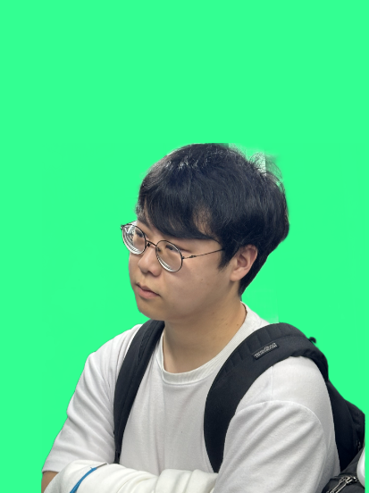

# Remove Background 
- 옷 사진을 등록할 때 배경을 제거
# Contents

# 고려중인 모델
- SAM
- rembg
## SAM
- [github](https://github.com/facebookresearch/segment-anything)
## rembg
- [github](https://github.com/danielgatis/rembg)
- fine tunine 가능
- python: >3.7, <3.12
### model

- u2net_cloth_seg :  A pre-trained model for Cloths Parsing from human portrait. Here clothes are parsed into 3 category: Upper body, Lower body and Full body.
- 산출물 : origin input(배경제거X)->알아보기 힘든 이미지
  - MAM-kwon input ->
  - 
- sam
  - input : dot(s)
  - 산출물
  - 
- mam
  - input : line or dot 
  - [github link](https://github.com/SHI-Labs/Matting-Anything)
  - 산출물
  - 


# 파이썬 환경 설정
### 가상환경(virtual venv)
- python -m venv myvenv 로 가상환경을 만들어주세요
- source myvenv/Scripts/activate 로 가상환경을 실행해주세요
### 필수 패키지 설치
- pip install -r requirements.txt 로 필요한 패키지를 설치해주세요
### main.py run
- main.py 파일을 run 해주세요


# pyenv 

- 여러 버전의 파이썬을 관리
## 사용법 
### 가상환경 생성
- pyenv virtualenv venv
- ~/.pyenv/versions 디텍터리 내에 저장
### 가상 환경 활성화
pyenv local venv
- 현재 디렉토리에서 venv 환경 사용


# conda 
## 사용법

### conda virtual venv create

- "venv" < 가상환경 명
```bash
conda --version
conda create -n venv
conda activate venv

```


## CUDA

### pytorch
### 현재 환경
- RTX 2060
- cuda 11.8
- [pytorch 2.1.0](https://pytorch.org/get-started/locally/)
```bash
pip3 install torch torchvision torchaudio --index-url https://download.pytorch.org/whl/cu118
```
