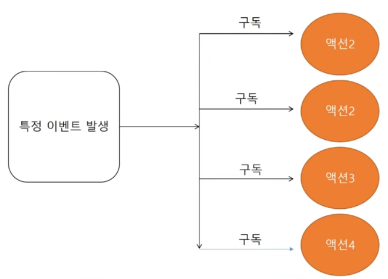

# Today I Learn

# 오전 방송
- 모바일 앱 개발을 위한 필수 라이브러리와 프레임워크 
## 자주 사용하는 기능
 - 서버와 통신
 - 이미지 불러오기
 - 권한 설정
 - 카메라
 - 등등
### 서버와 통신을 도와주는 라이브러리
- Retrofit2
- Http 객체를 이용한 통신
### 이미지를 손쉽게 처리할 수 있도록 도와주는 라이브러리
- GLide
  - Glide.with(this).load(R.drawable.img_file_name).into(imageView)
  
## 라이브러리의 장점 
- 효율적인 코드 작성
- 손쉬운 버전 관리
- 효율적인 유지보수

## Android Jetpack
- Jetpack은 개발자가 중요한 코드에 집중할 수 있도록 권장사항 준수, 상용구 코드 감소, 여러 Android 버전과 기기에서 일관되게 작동하는 코드 작성을 돕는 라이브러리 묶음입니다.

## CameraX
- 간편한 카메라 앱 개발용 Jetpack 지원 라이브러리

## ViewModel과 Livedata
- MVVM 패턴
- 데이터의 흐름을 효율적으로 관리

##  dagger2 / DI(Dependency Injection)
- 의존 관계 주입
### DI의 개념
- 의존성 주입의 기본적인 의미는 외부에서 클라이언트에게 서비스를 제공하는 것
- 다시 말해 객체가 필요로 하는 어떤 것을 외부에서 전달해주는 것으로 볼 수 있음
```java
class Drink{
    private Coffee coffee;
    
    public Drink(Coffee coffee){
        this.coffee = coffee;
    }
}
```
재사용 가능하도록 의존성을 주입하는 라이브러리 
어떤 부분이 더 효율적이고 좋았는지 생각해보면서 포트폴리오를 만들어보고 고민하는 것을 추천합니다

## RxKotlin/RxJava
- 옵저버 패턴
- 발행/구독


### 옵저버 패턴
- 특정 이벤트 발생시 동작 실행

