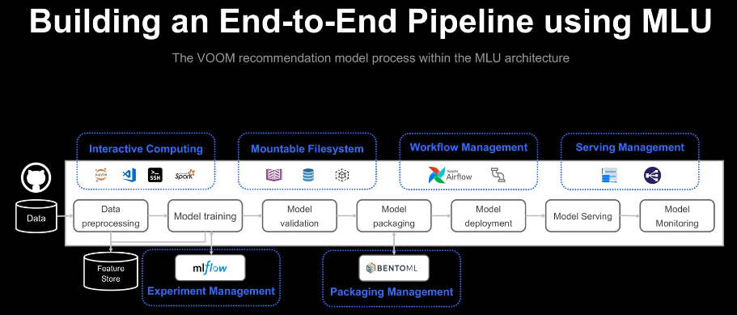

[https://engineering.linecorp.com/ko/blog/line-end-to-end-mlops-platform-mlu](https://engineering.linecorp.com/ko/blog/line-end-to-end-mlops-platform-mlu)

# LINE의 엔드 투 엔드 MLOps 플랫폼, MLU

## ML 파이프라인이란 
- 데이터 수집과 전처리, 모델 학습, 모델 배포, 모델 예측 등 ML 전체 과정을 순차적으로 처리하는 일련의 프로세스

## MLU를 활용한 파이프라인 자동화 사례 - LINE VOOM 'For You'
### 사용한 모델의 특징과 요구사항 
- 특징
  - ML 추천모델, 사용자에게 추천할만한 후보군을 생성한 뒤 
  - 사용자 피드백과 품질을 기반으로 데이터 검증 및 필터링 과정을 거치고
  - 그 데이터를 이용해 다양한 임베딩 과정을 거쳐 모델을 학습시키고 배포합니다
  - 이렇게 배포한 모델을 다시 피드백을 반영해 지속적으로 더 적합한 추천 포스트를 제공합니다

- 추천모델에서 중요한 것은 모델에 새로운 추천 후보군과 사용자 피드백을 자주 반영해 사용자가 지속 가능한 경험을 느끼게 만드는 것입니다.
- 매일 일정한 시각에 업데이트 하는 것이 가장 중요합니다.
- 하나의 모델에서만 결과를 만드는게 아니라 여러 모델의 결과를 종합해 사용자에게 앙상블한 결과를 추천할 경우 
  - 수십개의 파이프라인을 일정한 시각에 스케줄링해서 수행해야 합니다
  - 각 모델이 서로 영향을 주기 때문에 어떤 추천결과가 도출되는지 한눈에 파악할 수 있어야 합니다
  - 데이터와 모델 버전을 관리해 이력을 확인하는 것도 중요합니다

### MLU로 파이프라인 자동화
- MLflow에 모델 학습 과정에서 모든 로깅과 트래킹 저장하여, 연결된 데이터셋과 모델을 학습시키는 데 사용한 파라미터와 학습 척도 및 성능 관리
- BentoML로 도커라이징, API화(패키징), 서버 스케일 인아웃 관리
- Apache Airflow(Python 코드로 작동)를 이용해 워크플로 자동화 및 스케쥴링
- 

### 파이프라인 자동화 후 얻은 성과
- 모든 프로세스를 자동화하면서 운영 인력 비용과 발생하는 장애를 획기적으로 줄였습니다.
- 이를 통해 궁극적으로 모델 성능 향상에 집중할 수 있었습니다.
